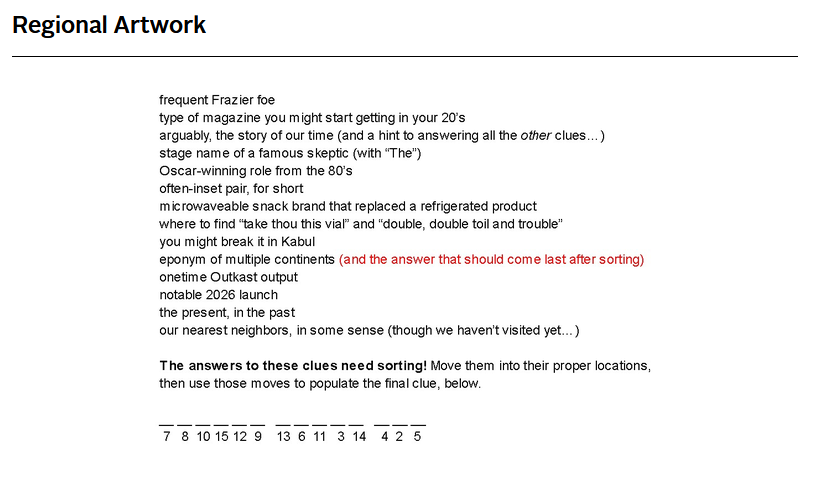

# June 2026 Puzzle

This month's puzzle was a riddle consisting of 14 clues which unlock a final clue for the solution. The clues are word puzzles referencing famous people, play references and word play to determine words.



The solutions to the clues in the order presented were found through collaboration with other people and LLM's as some of these were pop references I was not aware of. They are:

1. ALI
2. ALUMNI
3. AI
4. AMAZINGRANDI
5. ANTONIOSALIERI
6. AKHI
7. ACTII
8. ACTIVSCENEI
9. AFGHANI
10. AMERIGOVESPUCCI
11. AQUEMINI
12. ARTEMISIII
13. ANTIPASTI
14. ALPHACENTAURI

The most telling clue of all was the third "arguably, the story of our time (and a hint to answering all the _other_ clues....)", as it started the pattern of every clue solution starting with "A" and "I".

## Sorting

Looking at the final clue to be found at the bottom of the puzzle, we find numbers ranging from 2-15. These are references to the lengths of the solutions to the clues; the sorting is done by lengths.

```txt
AI
ALI
AKHI
ACTII
ALUMNI
AFGHANI
AQUEMINI
ANTIPASTI
ARTEMISIII
ACTIVSCENEI
AMAZINGRANDI
ALPHACENTAURI
ANTONIOSALIERI
AMERIGOVESPUCCI
```

## Getting the final clue

To get the final clue, we look at the indexes underneath the '\_'  of the missing final clue, these correspond to the words you must take a letter from by length i.e. the 7 means we will take a letter from the word whose length is 7 &rarr; AFGHANI.

The letter that will be picked from the word will be the zero indexed letter found at the location of |word length - original position|, where the | denote the absolute difference. See the table below.

|      Word       | Word length | Original position | Absolute diff |
| :-------------: | :---------: | :---------------: | :-----------: |
|       ALI       |      3      |         1         |       2       |
|     ALUMNI      |      5      |         2         |       3       |
|       AI        |      2      |         3         |       1       |
|  AMAZINGRANDI   |     12      |         4         |       8       |
| ANTONIOSALIERI  |     14      |         5         |       9       |
|      AKHI       |      4      |         6         |       2       |
|      ACTII      |      5      |         7         |       2       |
|   ACTIVSCENEI   |     11      |         8         |       3       |
|     AFGHANI     |      7      |         9         |       2       |
| AMERIGOVESPUCCI |     15      |        10         |       5       |
|    AQUEMINI     |      8      |        11         |       3       |
|   ARTEMISIII    |     10      |        12         |       2       |
|    ANTIPASTI    |      9      |        13         |       4       |
|  ALPHACENTAURI  |     13      |        14         |       1       |

## Solution

Using this logic we unlock the final clue "GEORGE LUCAS HIT" which in conjunction with the puzzle title "Regional Artwork" narrows the answer down to &rarr; American Graffiti.